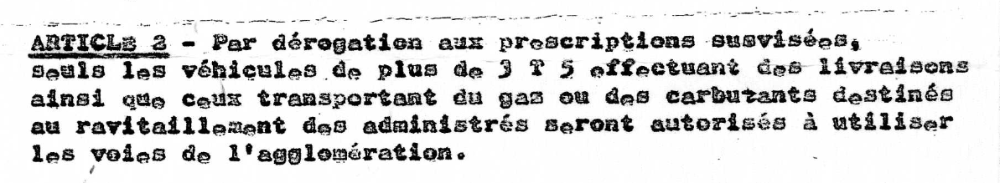

[Voir l'arrêté scanné du Rove](le-rove.jpg)

Le code INSEE de la commune est 13088

Nous pouvons déjà remplir les colonnes :

| COLL_NOM | ARR_INSEE
| -- | --
| Commune du Rove | 13088

La date de l'arrêté apparaît en signature.

Nous pouvons la mettre dans la colonne ARR_DATE :

| ARR_DATE |
| -- |
| 1979-01-11 |

Nous ne trouvons par contre par de référence pour l'arrêté, ni même d'objet. Nous attribuons la valeur NC

| ARR_OBJET | ARR_REF |
| -- | -- |
| NC | NC |

Par contre, nous trouvons une mention pour ARR_CONSIDERANT qui donne la justification pour appliquer l'arrêté :

| ARR_CONSIDERANT |
| -- |
| Considérant que l'intérêt majeur de la sécurité et de la tranquillité publique justifie pleinement la limitation ainsi apportée au libvre usage de l'agglomération aux véhicules de plus de 3.5 T ainsi que ceux transportant des matières dangereuses |

L'article 1 stipule la chose suivante :

Le premier cas semble concerner les poids lourds > 3.5 T tandis que dans le second semble concerner tous les véhicules transportant des carburants (quel que soit leur tonnage).

L'indication de rue est assez vague (Traversée du village), mais les début et fin de l'emprise donnent des indications. En allant sur OpenStreetMap, nous déduisons que la rue en question est l'avenue Joliot Curie

Nous rajoutons donc deux lignes dans notre tableau :

| REGL_ARTICLE | REGL_MODALITE | VEH_TYPES | VEH_PTAC | VEH_USAGES | EMPRISE_DESIGNATION | EMPRISE_DEBUT | EMPRISE_FIN
| -- | -- | -- | -- | -- | -- | -- | -- |
| 1 | Interdit | Poids lourds | 3.5 | | Avenue Joliot Curie (Traversée du village) | RN568B Entrée Est par l'avenue Jean Jaures	| Rue du Douard à l'Ouest
| 1 | Interdit | Tous véhicules | | Transport de matières dangereuses | Avenue Joliot Curie (Traversée du village) | RN568B Entrée Est par l'avenue Jean Jaures	| Rue du Douard à l'Ouest

L'article 2 stipule, lui :

Ce règlement s'applique à toute la commune. Nous introduisons la modalité d'autorisation de la façon suivante :

| REGL_ARTICLE | REGL_MODALITE | VEH_TYPES | VEH_PTAC | VEH_USAGES | EMPRISE_DESIGNATION |
| -- | -- | -- | -- | -- | -- |
| 2 | Autorise | Poids lourds | 3.5 | Livraison\|Transport de gaz\|Transport de carburant | Commune du Rove

[Voir l'arrêté final de la commune du Rove en CSV](le-rove.csv)
