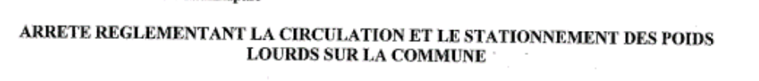
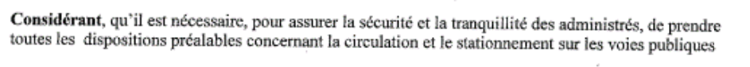
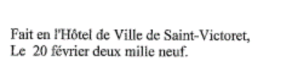
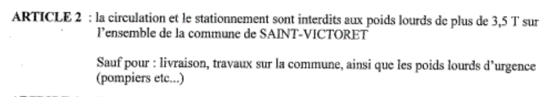

[Voir l'arrêté scanné de Saint Victoret](st-victoret.jpg)

Le code INSEE de la commune est 13102

| COLL_NOM | ARR_INSEE
| -- | --
| Commune de Saint-Victoret | 13102

Nous trouvons dessus la référence de l'arrêté

| ARR_REF |
| -- |
| 36/2009

Nous trouvons l'objet

| ARR_OBJET |
| -- |
| Arrêté règlementant la circulation et le stationnement des poids lourds sur la commune

Ainsi que le considérant

| ARR_CONSIDERANT |
| -- |
| Considérant qu'il est nécessaire pour assurer la sécurité et la tranquilité des administrés, de prendre toutes les dispositions préalables concernant la circulation et la stationnement sur les voies publiques |

Ainsi que la date. Attention, il ne faut pas prendre la date de l'arrêté initial, à savoir celui que cet arrêté remplace.

| ARR_OBJET |
| -- |
| 2009-02-20

C'est l'article 2 qu'il faut prendre en compte :

On le traduit de la sorte :

| REGL_ARTICLE | REGL_MODALITE | VEH_TYPES | VEH_PTAC | VEH_USAGES | EMPRISE_DESIGNATION |
| -- | -- | -- | -- | -- | -- |
| 2 | Interdit | Poids lourds | 3.5 || Commune de Saint-Victoret
| 2 | Autorise | Poids lourds | 3.5 |Livraison\|Poids lourds d'urgence\|Véhicules de travaux| Commune de Saint-Victoret

[Voir l'arrêté final de la commune de Saint Victoret en CSV](st-victoret.csv)

